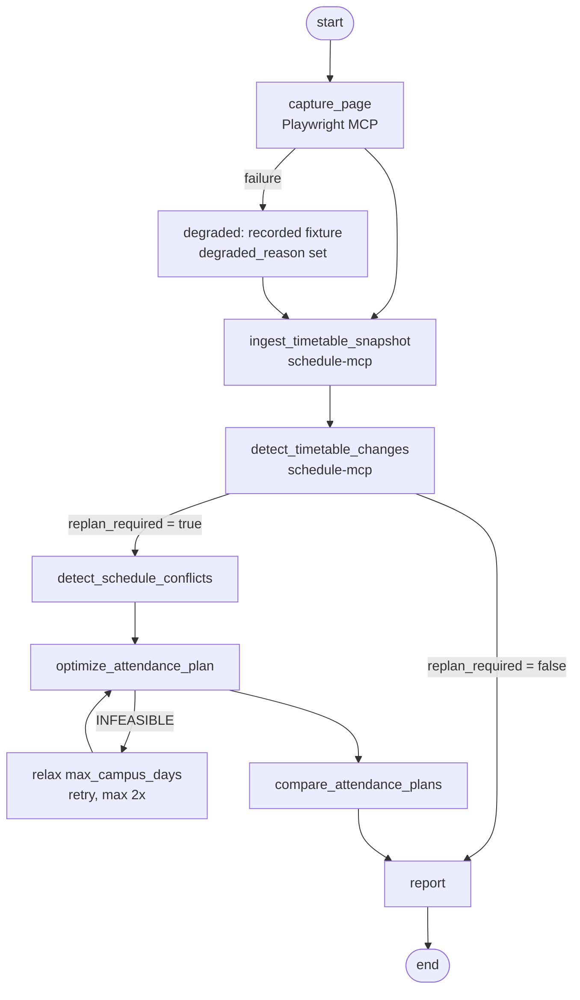

# Architecture and boundaries

## Processes

| Process | Started by | Transport | Talks to |
|---|---|---|---|
| `agent` | the student (`python -m agent.run`) | — | both MCP servers, OpenRouter |
| `schedule-mcp` | `python -m mcp_servers.schedule_mcp.server` | stdio | `data/`, `.state/` |
| `playwright-mcp` | `npx -y @playwright/mcp@latest` | stdio | the public timetable page |

Neither server imports anything from `agent/`, and the agent never imports the
tool implementations. The only coupling is the MCP wire protocol.

## Flow



## Where each value comes from

Useful for the "trace one value from source to final output" question at the
defence:

```
a cell in the timetable table on the public page
  -> Playwright MCP navigate/snapshot            -> state.raw_html
  -> parser.html_to_rows                          -> a raw row dict
  -> parser.rows_to_sessions                      -> Session(session_id=...)
  -> stored in .state/snapshots/<snapshot_id>.json
  -> optimize_attendance_plan                     -> PlanItem in .state/plans/<plan_id>.json
  -> compare_attendance_plans                     -> comparisons[].coverage_delta
  -> report                                       -> the sentence the student reads
```

## State

The custom server's only writable state is `.state/`:

```
.state/
  snapshots/<snapshot_id>.json     immutable, content-addressed
  snapshots.index.jsonl            append-only capture log
  plans/<plan_id>.json             deterministic given the same inputs
```

Git-ignored. Deleting it loses no source data — re-running ingest rebuilds it.
